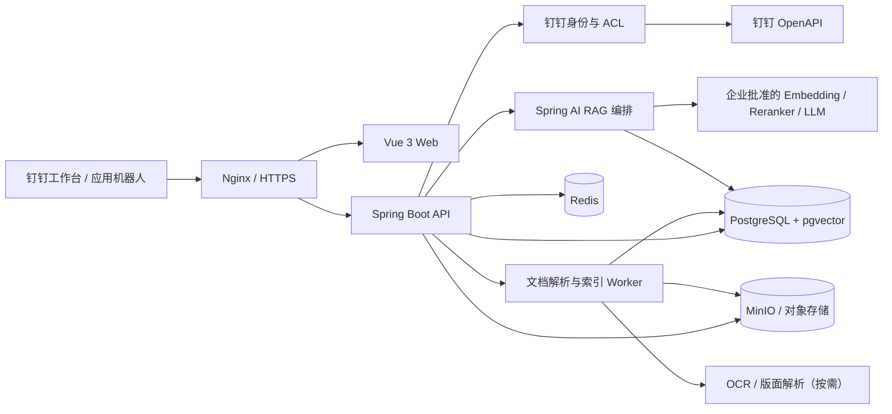

# 公司内部知识库问答系统：钉钉接入与 RAG 开发方案

> 方案日期：2026-07-16  
> 参考项目：`D:\weekly_report`（只读分析）  
> 推荐主形态：钉钉企业内部网页应用（原 H5 微应用）+ Spring Boot/Spring AI RAG 后端

## 1. 结论先行

钉钉不会替你运行 Spring 或 RAG 服务。正确的集成方式是：

1. 在钉钉开发者后台创建一个**企业内部应用**，添加**网页应用**能力。
2. 把本系统的 HTTPS 地址配置为 PC 端和移动端首页地址。
3. 员工从钉钉工作台打开该网页；PC 端显示“左侧知识库树 + 右侧问答”，移动端把知识库树折叠成抽屉。
4. 前端调用钉钉 JSAPI `requestAuthCode` 获取一次性免登码。
5. Spring 后端使用应用 `AccessToken + 免登码` 换取 `userId/unionId`，映射本地用户、部门和文档权限，再建立本系统会话。

因此，最主要的开发工作仍然是普通 Web RAG；钉钉侧的核心只是**应用注册、端内免登、身份/部门同步、权限范围和可选的机器人入口**。

不建议把系统直接做成纯机器人：机器人适合快速问一句、在群内 `@` 和发送通知，但不适合承载知识库目录、文档管理、来源预览和管理后台。推荐“网页应用为主，应用机器人为辅”。

## 2. 对现有 `weekly_report` 项目的判断

### 2.1 已有能力

该项目已经是一套完整的内网应用骨架：

- 前端：Vue 3、Vite、Element Plus、Vitest。
- 后端：Java 21、Spring Boot 3.3.5、Spring Security、JWT、JDBC、MySQL。
- 钉钉：应用凭证换取 `AccessToken`、通讯录/周报接口、网页 OAuth 登录、工作通知。
- 权限：用户、角色、钉钉 `userId/unionId`、部门/人员范围、后端服务层过滤。
- 工程化：Docker Compose、生产凭据校验、日志脱敏、单元测试、部署文档。

### 2.2 可复用与不可直接复用

| 模块 | 建议 | 原因 |
|---|---|---|
| Vue/Vite/Element Plus 工程骨架 | 复用思路或脚手架 | 已有 API 封装、认证状态、测试与响应式基础 |
| Spring Security 分层和异常处理 | 复用模式 | Controller/Service/Mapper 边界清晰 |
| `sys_user/sys_role/sys_user_role` | 复用并扩展 | 已绑定稳定的钉钉身份 |
| 部门/人员权限范围 | 复用设计，不直接照搬字符串规则 | RAG 必须把权限落实到文档和分块级 ACL |
| 钉钉应用凭证、Token 获取、通知客户端 | 抽成新的 `DingTalkClient` | 应增加 Token 缓存、统一错误码、超时、限流和新旧 API 隔离 |
| 当前网页 OAuth 登录 | 仅作为外部浏览器备用入口 | 钉钉工作台内应使用 `requestAuthCode` 端内免登 |
| URL 参数传 JWT + `localStorage` 保存 JWT | 不复用 | URL 会进入浏览器历史、代理和日志；新系统改用同源 `HttpOnly + Secure` 会话 Cookie |
| 周报 Python 采集与 `output/<week>` 文件契约 | 不复用 | 与知识库领域和在线问答无关 |
| 周报工作通知 | 可复用为运营通知 | 可用于文档索引失败、权限同步失败、反馈通知，不参与主问答链路 |

### 2.3 项目边界建议

新建独立仓库和独立钉钉应用，不要把知识库功能继续堆入 `weekly_report`：

- 两个系统的数据敏感度、权限范围、发布节奏和故障域不同。
- 使用独立 `Client ID/Client Secret/Agent ID`，只给知识库应用申请必要权限。
- 第一版可复制工程骨架；稳定后再提取公司内部的 `dingtalk-spring-boot-starter` 或共享库。

## 3. 钉钉中的产品形态

### 3.1 主入口：企业内部网页应用

PC 端：

```text
┌──────────────────────┬───────────────────────────────────────────┐
│ 公司知识库            │ 当前空间 / 文档范围                         │
│ [搜索知识库]          ├───────────────────────────────────────────┤
│ ▾ 人事制度            │ 问题：差旅报销需要哪些材料？                 │
│   ├─ 考勤制度         │                                           │
│   └─ 差旅与报销       │ 回答（流式生成）                            │
│ ▾ 产品文档            │ ……                                        │
│ ▾ 技术规范            │                                           │
│                       │ 来源：差旅制度 v3，第 4.2 节 [打开原文]      │
└──────────────────────┴───────────────────────────────────────────┘
```

移动端：知识库树放入左上角抽屉；默认展示问答；来源卡片可展开，不把 PC 双栏强行压缩。

建议的页面：

- 员工端：知识库树、问答、历史会话、来源预览、反馈。
- 知识管理员：空间/目录、上传与同步、解析状态、版本、ACL、重建索引。
- 系统管理员：钉钉同步、模型配置（不显示密钥）、审计、用量和健康状态。

### 3.2 辅助入口：应用机器人（第二阶段）

- 支持单聊问答和群内 `@机器人`。
- 回答只返回简短结论、引用和“在知识库中继续查看”的网页应用深链。
- 群聊回答必须按提问人的权限检索，不能按群成员权限并集检索。
- 不使用“自定义 Webhook 机器人”承担问答；官方说明其主要是群消息推送，不支持单聊。应使用企业内部**应用机器人**。

## 4. 钉钉端内免登设计

### 4.1 时序

```mermaid
sequenceDiagram
    participant U as 员工
    participant D as 钉钉客户端
    participant V as Vue 网页应用
    participant S as Spring 后端
    participant O as 钉钉 OpenAPI

    U->>D: 从工作台打开应用
    D->>V: 打开首页并注入 corpid
    V->>D: requestAuthCode(corpId)
    D-->>V: 一次性免登 code
    V->>S: POST /api/auth/dingtalk/inside {code, corpId}
    S->>O: 获取/读取缓存中的应用 AccessToken
    S->>O: AccessToken + code 换取 userId/unionId
    O-->>S: 用户稳定身份
    S->>S: 校验组织、用户状态、角色和数据范围
    S-->>V: Set-Cookie: KB_SESSION=...; HttpOnly; Secure
    V->>S: GET /api/me
    S-->>V: 用户信息和功能权限
```

### 4.2 必须处理的边界

- 免登码只有 5 分钟有效且只能使用一次；前端失败后重新取码，不重放旧码。
- 首页地址、重定向 URL、端内免登地址应使用同一受控 HTTPS 域名。
- `corpId` 必须在应用允许的组织列表中，不能只相信前端传值。
- 用户主键优先使用组织内稳定 `userId`；需要跨应用关联时保留 `unionId`。
- 不通过姓名自动授予知识权限；姓名只能用于展示或人工辅助绑定。
- 应用 `AccessToken` 在服务端按过期时间提前刷新并加分布式锁，不能每次问答重新申请。
- 同源部署 Vue 和 API，优先使用服务端会话 Cookie；避免在 URL、日志或 `localStorage` 中暴露长期令牌。
- 普通浏览器访问可保留网页 OAuth 备用登录，但它与端内免登是两条明确分开的适配器。

### 4.3 开发者后台配置清单

1. 创建企业内部应用，添加“网页应用”能力。
2. 同时配置 PC 端首页和移动端首页；首页建议带 `?corpid=$CORPID$`。
3. 在安全设置中配置端内免登地址、回调地址、受信域名和服务端出口公网 IP。
4. 只申请必要接口权限：免登身份；若同步组织则增加通讯录只读；若接钉钉知识库则增加相应文档/知识库权限；通知和机器人按阶段申请。
5. 先发布给测试部门/测试人员，验收后再扩大应用可见范围并加入工作台。
6. 配置稳定域名和 TLS；服务端必须能访问钉钉 OpenAPI，员工客户端必须能访问应用首页。

## 5. 推荐系统架构



### 5.1 技术选型

| 层 | 第一版推荐 | 说明 |
|---|---|---|
| Java | Java 21 + Spring Boot | 与现有项目一致，选择开发时最新兼容稳定版 |
| AI 编排 | Spring AI | 使用 `ChatModel/EmbeddingModel/VectorStore` 抽象，避免绑定单一厂商 |
| 前端 | Vue 3 + Vite + Element Plus | 可复用周报项目工程经验 |
| 元数据与向量 | PostgreSQL + pgvector | MVP 运维最简单，同时支持事务、ACL 条件和向量检索 |
| 关键词检索 | PostgreSQL FTS 起步 | 数据量或中文检索要求上升后换 OpenSearch |
| 会话/缓存 | Redis | Session、钉钉 Token、限流、短期对话状态 |
| 原文件 | MinIO 或已有对象存储 | 不把大文件和解析正文塞入关系库 |
| 文档解析 | Apache Tika + POI + PDFBox | 扫描 PDF 通过独立 OCR/版面解析服务 |
| 异步任务 | 数据库任务表起步 | 规模扩大后切 RabbitMQ/Kafka，不在 MVP 预先复杂化 |
| 流式回答 | SSE | 与 Spring/Vue 适配简单，需支持断连取消 |

如果公司必须继续使用 MySQL，可以使用“MySQL 存元数据 + 独立向量库”；但这会增加一个组件和跨库一致性问题。对新系统而言，PostgreSQL + pgvector 更直接。

### 5.2 建议的 Spring 模块

```text
com.youzhi.knowledge
├─ auth          # 钉钉端内免登、浏览器备用登录、会话
├─ dingtalk      # Token、用户/部门、知识库与机器人适配器
├─ identity      # 用户、部门、角色、同步
├─ knowledge     # 空间、目录、文档、版本、ACL
├─ ingestion     # 上传、解析、切分、Embedding、索引任务
├─ retrieval     # ACL 过滤、混合检索、重排、上下文组装
├─ chat          # 会话、SSE、引用、反馈
├─ admin         # 配置、任务、审计、指标
└─ common        # 错误、脱敏、ID、时钟、基础设施
```

不要让 Controller 直接访问向量库；所有检索都必须经过 `AuthorizedRetrievalService`，避免某个新接口忘记加 ACL。

## 6. 知识来源策略

### 6.1 MVP：系统自管知识库

管理员在网页应用上传 PDF、DOCX、XLSX、PPTX、Markdown、TXT，配置目录和可见范围。这条路线最容易完成可靠的解析、版本和权限闭环。

### 6.2 第二阶段：同步钉钉知识库

钉钉官方知识库支持目录树、多级权限及知识库/文档接口，可作为外部知识源。接入时需要：

- 记录钉钉知识库、节点、文件和版本的外部 ID。
- 使用增量游标或事件回调处理新增、修改、移动、删除和权限变化。
- 明确“以应用服务身份同步”还是“以当前操作人身份读取”。
- 把源权限翻译成本系统文档 ACL；权限同步失败时停止发布新版本，不能默认公开。
- 删除或失权时同时删除/冻结正文、分块和向量，避免旧向量继续被召回。

不建议第一版同时实现“本地上传 + 钉钉知识库 + 钉盘 + 多个第三方文档库”，否则主要精力会耗在同步一致性而不是问答质量。

## 7. RAG 核心链路

### 7.1 入库

```text
上传/同步
  -> 文件类型、大小、病毒与扩展名校验
  -> 对象存储保存原件并计算 SHA-256
  -> 文本/表格/标题/页码解析
  -> 结构化切分（标题优先，滑动窗口为补充）
  -> 生成 Embedding
  -> 写入 chunk + vector + ACL + version
  -> 抽样校验后原子发布该文档版本
```

建议分块目标为约 400～800 tokens、重叠 10%～15%，但应按标题、条款和表格边界切分，不要机械固定字符数。每个分块保存 `documentId/version/page/section/sourceUrl/acl`。

### 7.2 问答

```text
问题 + 当前用户
  -> 输入校验与会话压缩
  -> 解析知识空间/目录筛选
  -> 先应用 ACL，再做关键词 + 向量混合检索
  -> Reranker 重排
  -> 去重并组装有上限的上下文
  -> LLM 生成带引用的回答
  -> 引用存在性与权限二次校验
  -> SSE 返回回答、引用和置信状态
```

回答规则：

- 只根据提供的授权资料回答；资料不足时明确说“不确定/未找到依据”。
- 每个关键结论带来源，来源可打开原文对应页/章节。
- 禁止把模型记忆当作公司制度依据。
- 对“忽略系统提示、泄露其他部门资料”等文档内提示按不可信内容处理。
- 默认只带最近必要对话，不把整个历史和整篇文档发给模型。

### 7.3 防止 `payload too large`

- 上传接口限制单文件、单批次和请求体大小；大文件使用直传对象存储或分片上传。
- 解析、Embedding 按批处理，不把整库内容放进单次任务消息。
- 检索阶段设 `candidateTopK`、`rerankTopN`、去重和总 token 预算。
- 长对话只保留最近轮次 + 服务端摘要；引用片段不重复塞入历史。
- SSE 只发送增量 token 和小型引用元数据，不在每个事件重复完整答案。
- API 列表分页；文档预览按页/片段加载；日志不记录完整请求、原文或模型上下文。
- 对模型网关分别设置请求字节数、最大上下文 tokens、输出 tokens 和超时，超限返回可诊断但脱敏的错误。

## 8. 数据与权限模型

核心表建议：

| 表 | 用途 |
|---|---|
| `sys_user`, `sys_department`, `sys_role`, `sys_user_role` | 钉钉身份和本地功能角色 |
| `knowledge_space`, `knowledge_node` | 左侧知识库与目录树 |
| `knowledge_document`, `document_version` | 文档元数据、版本和发布状态 |
| `document_acl` | 用户/部门/角色的查看、管理权限 |
| `document_chunk` | 分块文本、页码、章节、版本、向量 |
| `ingestion_job`, `sync_cursor` | 解析和外部同步状态、幂等游标 |
| `conversation`, `chat_message` | 会话与消息；按保留策略清理 |
| `answer_citation`, `answer_feedback` | 引用证据和用户反馈 |
| `audit_log` | 登录、上传、授权、删除、问答访问元数据 |

权限原则：

1. 功能权限（谁能上传/管理）与数据权限（谁能读哪份文档）分离。
2. 文档默认私有，显式授权后才发布。
3. ACL 在向量检索 SQL/过滤表达式中前置执行，不能“先召回后在 Java 里隐藏”。
4. 引用返回前再次校验文档版本和当前 ACL，防止权限在生成期间变化。
5. 缓存键必须包含用户/权限版本，不能跨用户复用带私有上下文的答案。
6. 部门变更、离职和文档失权应尽快让 Session/权限缓存失效。

## 9. API 草案

```text
POST   /api/auth/dingtalk/inside          # 免登码换本系统会话
GET    /api/me
POST   /api/logout

GET    /api/knowledge/tree
GET    /api/knowledge/documents/{id}
GET    /api/knowledge/documents/{id}/preview?page=1
POST   /api/admin/documents/upload
POST   /api/admin/documents/{id}/publish
PUT    /api/admin/documents/{id}/acl
DELETE /api/admin/documents/{id}
GET    /api/admin/ingestion-jobs/{id}

POST   /api/chat/conversations
GET    /api/chat/conversations
GET    /api/chat/conversations/{id}/messages
POST   /api/chat/conversations/{id}/stream   # text/event-stream
POST   /api/chat/messages/{id}/feedback

POST   /api/admin/dingtalk/sync/users
POST   /api/admin/dingtalk/sync/knowledge
GET    /api/admin/audit
```

`/stream` 请求只传问题、会话 ID 和可选的空间/目录 ID；不允许前端上传任意“已检索上下文”，以免绕过后端权限。

## 10. 安全与运维

- 新应用使用独立最小权限钉钉凭据，密钥只放密钥管理服务或部署环境变量。
- 生产全站 HTTPS；Cookie 使用 `HttpOnly/Secure/SameSite`，增加 CSRF 防护。
- 服务端出口 IP 固定并配置到钉钉安全设置；外部回调校验签名、防重放并保证幂等。
- 原文件、解析正文、问题、回答和引用均按公司内部数据处理；日志只保留必要元数据。
- 模型服务必须经过公司批准；敏感知识优先使用私有化模型或明确不留存/不训练的企业接口。
- 对象存储加密、数据库备份加密；删除文档要覆盖原件、解析结果、向量和缓存。
- 文档解析在受限 Worker 中执行，禁用宏和主动内容；上传做病毒扫描和压缩炸弹防护。
- 记录“谁在何时问了哪个知识空间、引用了哪些文档”，默认不在普通运维日志记录完整问题和回答。
- 监控钉钉 Token 获取、免登成功率、解析积压、向量检索、模型延迟、SSE 断连、越权拒绝和成本。

部署建议：

```text
Internet/公司网络
  -> Nginx 443
  -> Spring Boot（同源托管 Vue）
  -> PostgreSQL/pgvector + Redis + MinIO
  -> 文档 Worker
  -> 企业批准的模型服务
```

如果模型、Embedding 和 OCR 都调用外部企业 API，试点可从 `4C/8G` 应用服务器起步；若本地运行 OCR、Embedding 或大模型，需要按模型单独规划 CPU/GPU，不能沿用周报系统约 3 GB 内存的部署预算。

## 11. 实施路线

### 阶段 0：钉钉接入验证（2～3 天）

- 创建测试企业内部网页应用。
- PC/移动端工作台打开同一 Vue 页面。
- 完成 `requestAuthCode -> userId -> HttpOnly Session`。
- 验证测试人员范围、出口 IP、HTTPS、端内和普通浏览器差异。

**退出标准**：测试员工从钉钉打开后无需输入账号，后端拿到正确且稳定的 `userId`，未授权员工被拒绝。

### 阶段 1：知识库 MVP（1～2 周）

- 空间/目录/文档管理、上传、解析状态、ACL。
- 支持 Markdown/TXT/PDF/DOCX，先不承诺复杂扫描件和复杂 Excel。
- PostgreSQL + pgvector、MinIO、基础管理页面。

### 阶段 2：可用 RAG（1～2 周）

- 混合检索、重排、引用、流式回答、无依据拒答。
- 会话历史、反馈、token/payload 预算、限流。
- 建立 100～200 条公司真实问题的离线评测集。

### 阶段 3：权限与生产化（1～2 周）

- 钉钉部门同步、ACL 前置过滤、失权清理、审计。
- 备份恢复、监控告警、压测、安全测试、灰度发布。
- 钉钉 PC、Android、iOS 真机验收。

### 阶段 4：增量能力

- 钉钉知识库增量同步。
- 应用机器人和群聊深链。
- OCR/复杂表格、答案缓存、运营分析、多模型路由。

一名熟悉 Java/Vue 的开发者做可试用 MVP，现实工期约 4～6 周；达到有权限审计、同步一致性和稳定运维的生产版本，建议预留 6～10 周。RAG Demo 很快，真正耗时的是文档质量、ACL、钉钉端内兼容和评测。

## 12. 验收指标

| 类别 | 建议指标 |
|---|---|
| 身份 | 端内免登成功率 >= 99.5%，错误不泄露凭据 |
| 权限 | 自动化越权用例 100% 拒绝；测试期不得出现跨部门引用 |
| 检索 | 评测集 Recall@10 达到约定阈值，按知识域分别统计 |
| 回答 | 有依据问题的引用正确率、忠实度和可回答率达到业务阈值 |
| 拒答 | 无依据/无权限问题不编造制度，不泄露文档存在性 |
| 性能 | 非模型 API P95 < 500 ms；首 token P95 由所选模型单独定标 |
| 入库 | 文档版本可追踪；失败可重试；删除/失权可验证地清除索引 |
| 兼容 | 钉钉 PC、Android、iOS 的登录、问答、来源打开全部通过 |

必须覆盖的测试：过期/重放免登码、同名员工、离职/调部门、无权文档、权限中途变化、删除后旧向量、恶意文档提示、超大文件、超长问题、长会话、SSE 断线、模型超时和钉钉接口限流。

## 13. 开工前需要确定的业务决策

以下问题不会阻塞技术预研，但会决定生产架构：

1. 第一批知识来自系统上传，还是现有钉钉知识库？推荐先系统上传。
2. 文档是否允许发送到外部模型服务？若不允许，需要明确私有化模型和 GPU 预算。
3. 权限按“全公司/部门/指定人”是否足够，是否有项目组、密级或文档级例外？
4. 预计文档量、总页数、日活、并发问答和每天问题量是多少？
5. 应用首页在公网 HTTPS、公司专网还是 VPN 中；移动钉钉能否访问？
6. 问答和会话需要保留多久，员工是否可以删除，审计保留多久？
7. 是否一期就要求机器人、OCR、Excel/PPT 复杂解析和钉钉知识库同步？推荐放到后续阶段。

## 14. 官方文档依据（检索于 2026-07-16）

- [钉钉开发文档中心](https://open.dingtalk.com/document/)：网页应用可集成到工作台与聊天菜单。
- [配置网页应用](https://open.dingtalk.com/document/dingstart/configure-web-application)：PC/移动端首页配置、工作台展示和应用捷径；页面更新于 2026-06-30。
- [开发网页应用前端](https://open.dingtalk.com/document/dingstart/develop-webapp-frontend)：JSAPI 鉴权、`corpId` 注入和前端开发流程；页面更新于 2026-06-30。
- [开发网页应用服务端](https://open.dingtalk.com/document/dingstart/develop-webapp-backend)：免登、接口权限和服务端出口 IP；页面更新于 2026-06-30。
- [企业内部网页应用免登](https://open.dingtalk.com/document/development/enterprise-internal-application-logon-free)：端内免登和域名要求；页面更新于 2026-07-02。
- [`requestAuthCode`](https://open.dingtalk.com/document/development/jsapi-request-auth-code)：免登码 5 分钟有效且只能使用一次；页面更新于 2025-08-27。
- [通过免登码获取用户信息](https://open.dingtalk.com/document/development/obtain-the-userid-of-a-user-by-using-the-log-free)：`AccessToken + code` 换取 `userid/unionid`；页面更新于 2026-07-02。
- [钉钉机器人概述](https://open.dingtalk.com/document/dingstart/robot-application-overview)：应用机器人支持单聊/群聊对话，自定义 Webhook 机器人不支持单聊；页面更新于 2026-06-30。
- [钉钉知识库概述](https://open.dingtalk.com/document/development/knowledge-base-overview)：目录树、多级权限、知识库与文档开放接口；页面更新于 2026-05-15。

## 15. 推荐的第一项开发任务

不要先写 RAG。先做一个最小的 `dingtalk-auth-spike`：只有 Vue 欢迎页、Spring 免登接口、`/api/me` 和一个受保护接口，在测试组织的钉钉 PC/手机工作台跑通。这个验证完成后，再基于同一会话和身份模型开发知识库 ACL 与 RAG，可以避免做到最后才发现应用域名、出口 IP、端内免登或移动网络不可用。
